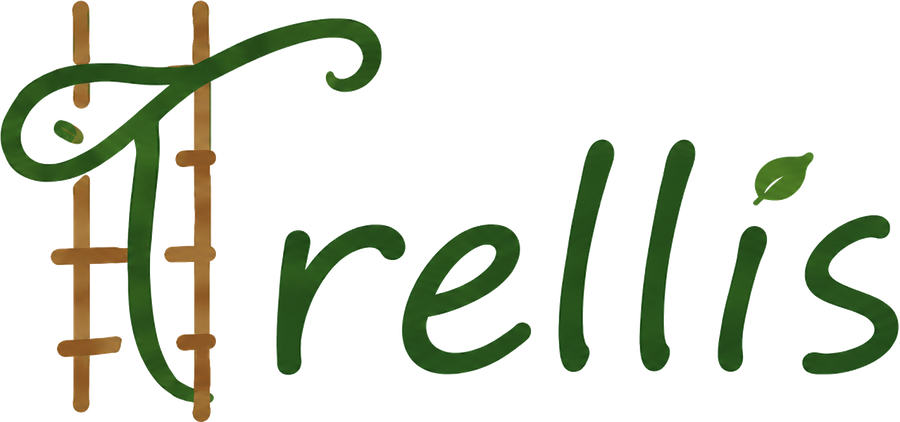
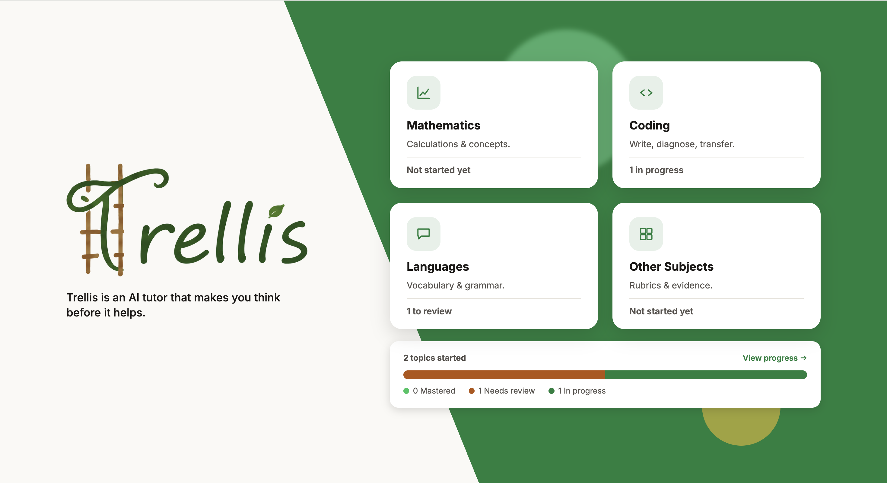
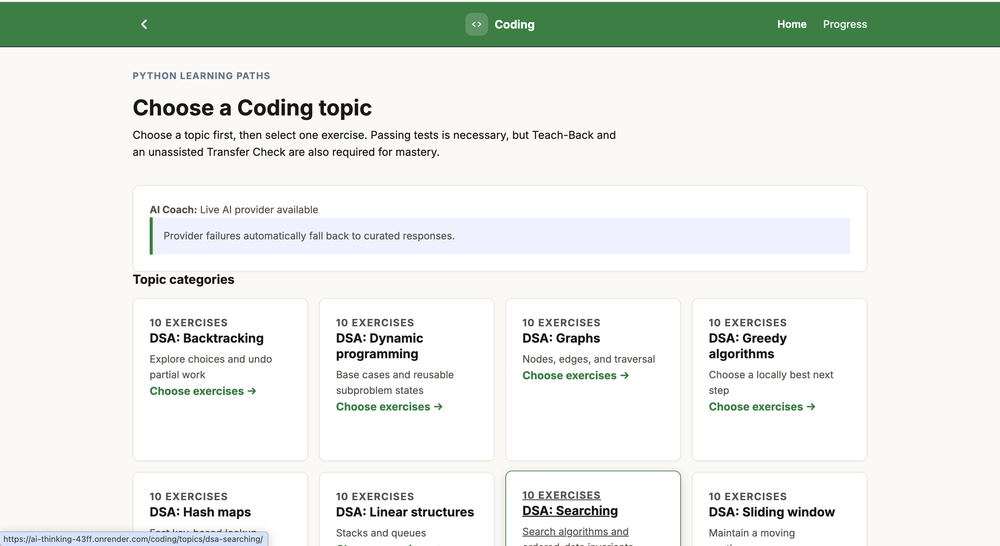
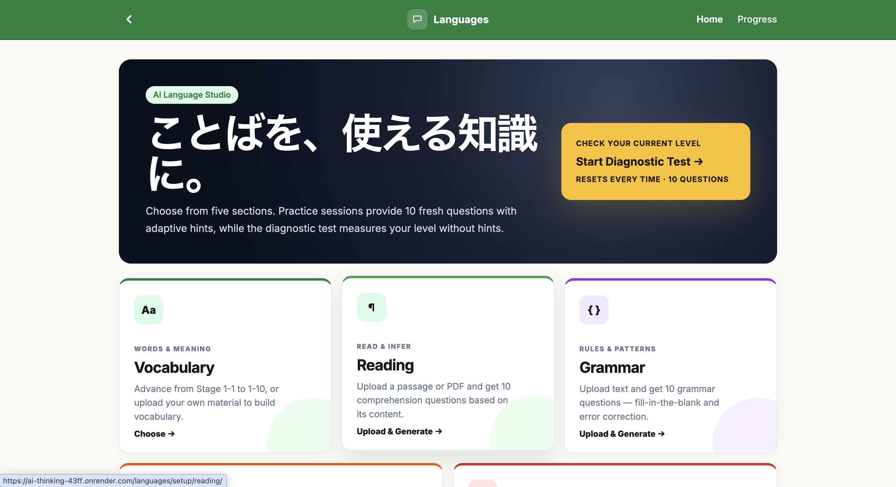
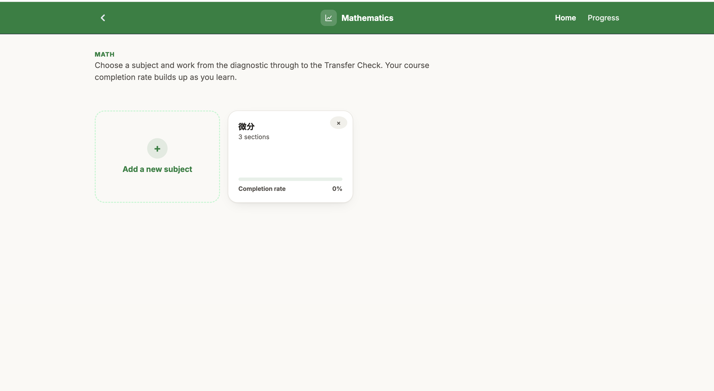
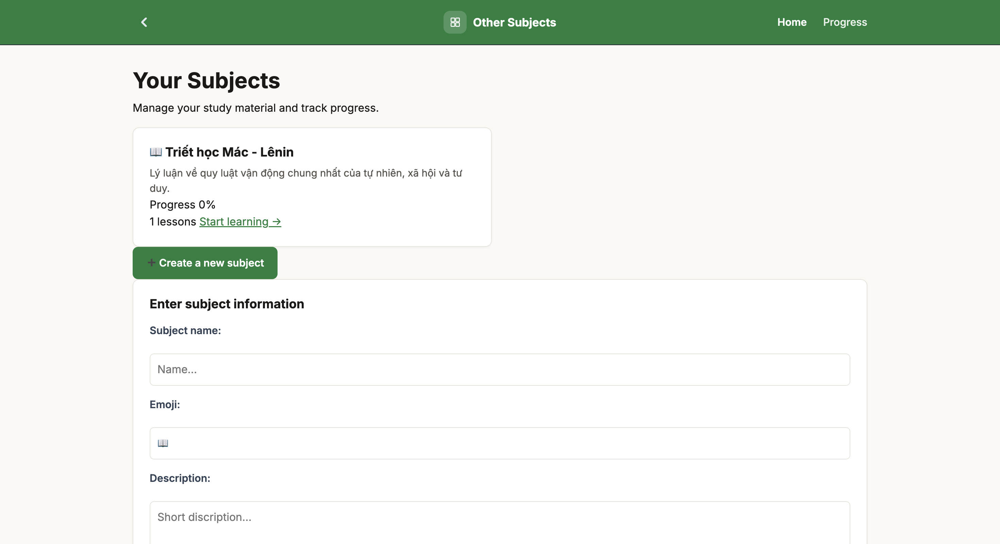

# AI-thinking（Trellis）



> **テーマ**：AIを当たり前に使う時代に、学生が自分で考え、判断し、成長できる学びをデザインせよ

**答えを渡す前に、考える段階を渡すAI学習アプリ。**

AIに聞けば、考えなくてもすぐ答えが返ってくる。その結果、考えるより前にAIに答えを聞く癖がついてしまう——これが解決したい問題です。Trellisは、1問に対して段階的にヒントを与えて考えさせることで、この癖を徐々に無くしていきます。AIはすぐには答えず、詰まったら段階的にヒントを出し、理解できたかどうかは、自分の言葉で説明できるかで確認する。仕組みそのものを作ることで、「考える前にAIに頼る癖」をなくすことを支援するアプリです。

[日本語](#日本語) | [English](#english) | [Tiếng Việt](#tiếng-việt)

---

## 日本語



### 主な機能

<table>
<tr>
<td width="50%">

**コーディング**
トピックを選んでコードを書く → テストを実行（Docker隔離環境） → AIが誤解を診断し段階的にヒントを出す → 自分の言葉で説明（Teach-Back） → 別の問題で応用できるか確認 → 習得判定



</td>
<td width="50%">

**語学**
語彙・読解・文法の練習。自分の教材（PDF/Word）をアップロードすると専用コースを自動生成



</td>
</tr>
<tr>
<td width="50%">

**数学**
最初の挑戦→診断→検証→ガイド付き修正→Teach-Back→応用確認、という独自フロー



</td>
<td width="50%">

**その他教科**
好きな科目名を作成し、資料をアップロードするとAIが問題を自動生成



</td>
</tr>
</table>

- **進捗ダッシュボード** — 4教科横断で習得済み・要復習・進行中を一覧表示
- **多言語対応** — 日本語・英語・ベトナム語

### 技術的な工夫

- **AIプロバイダーの3段フォールバック**（DeepSeek → Gemini → Groq）。1つのサービスが落ちても、次のプロバイダーに自動で切り替わり、学習が止まらないようにした
- **コード実行はDockerで隔離**。学習者が書いたコードの不具合（無限ループなど）が、サーバー全体に影響しないようにした
- **理解度の判定基準（ルーブリック）を事前にコードで定義**。AIの気分で採点基準が揺れないよう、AIの役割は「決められた基準を満たしているか」を意味ベースで判定することに限定した
- **誤解の記録は追記型、判定は「最新の1件だけ」を見る設計**。一度解決した誤解が、古い記録のせいで永久に「要復習」のままにならないようにした
- **学習の進み方を状態機械で管理**。AIが答えを出せる段階をサーバー側のコードで固定し、プロンプトでの指示だけに頼らない設計にした

### テスト

```bash
python manage.py test
```

現在466件のテストが通っている（2026年8月時点）。

### 技術スタック

- **バックエンド**：Python / Django
- **データベース**：SQLite（開発）/ MySQL（本番）
- **AI**：Gemini / DeepSeek / Groq（フォールバック構成）
- **コード実行**：Docker（隔離されたコード実行サービス、`runner_service`）
- **デプロイ**：waitress / whitenoise

> 本番環境へのデプロイ手順・セキュリティ設定は [`PRODUCTION.md`](PRODUCTION.md)、コーディング演習の作り方・カタログへの取り込み方は [`CODING_CATALOG.md`](CODING_CATALOG.md) に別途まとめてある。

### セットアップ（Mac / Linux）

```bash
git clone https://github.com/ai-thinking-team/AI-thinking.git
cd AI-thinking
python3.12 -m venv venv
source venv/bin/activate
pip install -r requirements.txt
python -c "from django.core.management.utils import get_random_secret_key; open('.env','w').write(f'SECRET_KEY={get_random_secret_key()}\n')"
python manage.py migrate
python manage.py runserver
```

### セットアップ（Windows）

PowerShellの場合：

```powershell
git clone https://github.com/ai-thinking-team/AI-thinking.git
cd AI-thinking
python -m venv venv
venv\Scripts\Activate.ps1
pip install -r requirements.txt
python -c "from django.core.management.utils import get_random_secret_key; open('.env','w').write(f'SECRET_KEY={get_random_secret_key()}\n')"
python manage.py migrate
python manage.py runserver
```

コマンドプロンプトの場合：

```cmd
git clone https://github.com/ai-thinking-team/AI-thinking.git
cd AI-thinking
python -m venv venv
venv\Scripts\activate.bat
pip install -r requirements.txt
python -c "from django.core.management.utils import get_random_secret_key; open('.env','w').write(f'SECRET_KEY={get_random_secret_key()}\n')"
python manage.py runserver
```

### トラブルシューティング（Windows）

**必要なPythonバージョン**：Python 3.10以上が必要です（`python --version` で確認できます）。インストールされていない場合は [python.org](https://www.python.org/downloads/) からダウンロードし、インストール時に「Add python.exe to PATH」に必ずチェックを入れてください。

**「このシステムではスクリプトの実行が無効になっています」と出る場合**：PowerShellで下記を実行してから、もう一度 `venv\Scripts\Activate.ps1` を試してください。

```powershell
Set-ExecutionPolicy -Scope Process -ExecutionPolicy Bypass
```

**「'python' は、内部コマンドまたは外部コマンド...として認識されていません」と出る場合**：Pythonがインストールされていないか、PATHが通っていません。上記のPythonインストール手順を確認してください。

---

## English

### Theme

Design a learning experience that lets students think, judge, and grow for themselves in an era where using AI is taken for granted.


### Main Features

<table>
<tr>
<td width="50%">

**Coding**
Pick a topic, write code → run tests in an isolated Docker sandbox → AI diagnoses the misconception and gives step-by-step hints → explain the fix in your own words (Teach-Back) → confirm the concept transfers to a new problem → mastery decision


</td>
<td width="50%">

**Languages**
Vocabulary, reading, and grammar practice. Upload your own material (PDF/Word) to auto-generate a custom course


</td>
</tr>
<tr>
<td width="50%">

**Math**
A separate flow: first attempt → diagnosis → verification → guided revision → Teach-Back → transfer check


</td>
<td width="50%">

**Other Subjects**
Create any subject you like; upload material and AI generates questions for it


</td>
</tr>
</table>

- **Progress dashboard** — Mastered / needs-review / in-progress status across all four subjects in one view
- **Multilingual** — Japanese, English, Vietnamese

### Technical Highlights

- **Three-tier AI provider fallback** (DeepSeek → Gemini → Groq). If one provider is down, the app automatically falls through to the next so learning never stops
- **Code execution isolated in Docker.** A learner's buggy code (infinite loops, etc.) can't affect the rest of the server
- **Grading rubrics are defined in code ahead of time**, not invented by the AI at request time. The AI's job is limited to judging semantically whether a fixed set of criteria is met
- **Misconception records are append-only, but only the latest one per code counts** — so a misconception that was already resolved doesn't stay flagged "needs review" forever because of a stale row
- **Learning progression is enforced by a state machine.** Which steps the AI is allowed to answer in is fixed in server-side code, not left to a prompt instruction alone

### Tests

```bash
python manage.py test
```

466 tests passing as of August 2026.

### Tech Stack

- **Backend**: Python / Django
- **Database**: SQLite (development) / MySQL (production)
- **AI**: Gemini / DeepSeek / Groq (fallback chain)
- **Code execution**: Docker (isolated runner service, `runner_service`)
- **Deployment**: waitress / whitenoise

### Setup (Mac / Linux)

```bash
git clone https://github.com/ai-thinking-team/AI-thinking.git
cd AI-thinking
python3.12 -m venv venv
source venv/bin/activate
pip install -r requirements.txt
python -c "from django.core.management.utils import get_random_secret_key; open('.env','w').write(f'SECRET_KEY={get_random_secret_key()}\n')"
python manage.py migrate
python manage.py runserver
```

### Setup (Windows)

PowerShell:

```powershell
git clone https://github.com/ai-thinking-team/AI-thinking.git
cd AI-thinking
python -m venv venv
venv\Scripts\Activate.ps1
pip install -r requirements.txt
python -c "from django.core.management.utils import get_random_secret_key; open('.env','w').write(f'SECRET_KEY={get_random_secret_key()}\n')"
python manage.py migrate
python manage.py runserver
```

Command Prompt:

```cmd
git clone https://github.com/ai-thinking-team/AI-thinking.git
cd AI-thinking
python -m venv venv
venv\Scripts\activate.bat
pip install -r requirements.txt
python -c "from django.core.management.utils import get_random_secret_key; open('.env','w').write(f'SECRET_KEY={get_random_secret_key()}\n')"
python manage.py runserver
```

For the full local Coding workflow, start the isolated runner in a second PowerShell as
described in [runner_service/README.md](runner_service/README.md). Development settings use
`http://127.0.0.1:8765` as the runner URL by default, so no extra `.env` entry is required.

### Troubleshooting (Windows)

**Required Python version**: Python 3.10 or later is required (check with `python --version`). If not installed, download it from [python.org](https://www.python.org/downloads/) and make sure to check "Add python.exe to PATH" during installation.

**If you see "running scripts is disabled on this system"**: Run the following in PowerShell, then try `venv\Scripts\Activate.ps1` again.

```powershell
Set-ExecutionPolicy -Scope Process -ExecutionPolicy Bypass
```

**If you see "'python' is not recognized as an internal or external command"**: Python is not installed, or not added to PATH. Follow the installation steps above.

### Local isolated Coding runner

The Coding workflow requires a separate Docker-backed HTTP runner before a revision can be verified as `PASSED`. See [`runner_service/README.md`](runner_service/README.md). Without that service, submissions safely remain `NOT_EXECUTED` and cannot unlock Teach-Back or Mastery.

For the reproducible local demo, start the runner in one PowerShell and Django in another:

```powershell
cd path\to\AI-thinking
powershell -ExecutionPolicy Bypass -File .\runner_service\start.ps1
```

Then verify readiness from the second terminal:

```powershell
.\venv\Scripts\python.exe manage.py check_local_demo
```

Open Django at `http://127.0.0.1:8004/`. The runner listens only on local loopback at
`http://127.0.0.1:8765/`.

### Coding exercise catalog and history

`python manage.py migrate` creates and seeds the initial database-backed Coding catalog. The
catalog currently contains 210 curated exercises across conditionals, functions, one-dimensional
lists, two-dimensional lists, strings, loops, recursion, dictionaries, list indexing, and advanced
Python DSA topics: binary search, stacks, queues, sorting, hash maps, graphs, and dynamic
programming. It also includes Python sets, comprehensions, exception handling, and numeric
algorithms, plus DSA two pointers, sliding windows, greedy algorithms, and backtracking.
Every topic has at least ten exercises, including warm-up, boundary-case, mixed-input, applied,
review, and mastery drills.
Example exercise slugs include `double-numbers`, `square-numbers`, `increment-numbers`,
`lookup-dictionary-grade`, `safe-divide-function`, `first-list-item`, `classify-number`,
`rectangle-area`, `sum-one-dimensional-list`, `matrix-total`, `reverse-string`,
`triple-numbers`, `factorial-recursion`, `binary-search-index`, `valid-brackets-stack`,
`rotate-queue`, `selection-sort`, `two-sum-hash-map`, `graph-has-path`, and
`climb-stairs-dp`, `is-leap-year`, `is-palindrome`, `power-of-two-recursion`,
`first-binary-search-index`, `insertion-sort`, `character-frequencies`,
`shortest-graph-path`, and `min-cost-climbing-stairs`; prompts,
rubrics, public/hidden runner IDs, and Transfer Check configuration are selected per exercise.
Opening `/coding/` first lists topic categories, then shows the active exercises for the selected
topic. Each browser can keep one active session per exercise,
while Reset closes the current session instead of deleting it. Previous code attempts, Teach-Back
evidence, misconceptions, Transfer Checks, and mastery decisions remain available under
`/progress/`.

### Use MySQL on Windows

Install MySQL Server 8 on Windows, create an `utf8mb4` database and a dedicated user, then set:

```env
DB_ENGINE=mysql
DB_NAME=ai_thinking
DB_USER=ai_thinking_user
DB_PASSWORD=replace_with_your_password
DB_HOST=127.0.0.1
DB_PORT=3306
```

Install dependencies and initialize the new database:

```powershell
venv\Scripts\python.exe -m pip install -r requirements.txt
venv\Scripts\python.exe manage.py migrate
venv\Scripts\python.exe manage.py check
```

The session uniqueness rule uses a nullable active slot instead of a conditional index, so it is
enforced by MySQL while still allowing any number of ended sessions to remain as history.

### Optional DeepSeek or Gemini AI Coach

DeepSeek is the preferred fallback when Gemini quota is unavailable. Add a DeepSeek API key to
`.env`; the adapter uses the OpenAI-compatible HTTP endpoint and requires no additional SDK:

```env
DEEPSEEK_API_KEY=your-key-here
DEEPSEEK_MODEL=deepseek-v4-flash
DEEPSEEK_BASE_URL=https://api.deepseek.com
AI_PROVIDER_CLASS=apps.ai_engine.providers.deepseek.DeepSeekProvider
```

Gemini remains available by configuration:

```env
GEMINI_API_KEY=your-key-here
GEMINI_MODEL=gemini-2.5-flash
AI_PROVIDER_CLASS=apps.ai_engine.providers.gemini.GeminiProvider
```

To enable semantic AI grading for Teach-Back, put one provider key in the local `.env`, run
`venv\Scripts\python.exe -m pip install -r requirements.txt`, and restart Django. The Coding page
will then show `Live AI provider available`. Teach-Back sends the current exercise's rubric and the
learner's answers to the selected provider; the server validates the structured response and retains
control of progression. Without a key, it shows `Curated fallback ready` and remains usable.

Verify the configured provider with a data-free structured request before a demo:

```powershell
venv\Scripts\python.exe manage.py check_ai_provider
```

The command reports only a safe status code and latency; it never prints the API key.

Run the opt-in end-to-end Coding check while the local runner is healthy. This executes real
Dictionary code in Docker and calls the configured AI provider; transient provider rate limits are
expected to exercise the curated fallback path without blocking the workflow:

```powershell
$env:RUN_LIVE_CODING_INTEGRATION='1'
venv\Scripts\python.exe manage.py test apps.coding_quiz.tests.LiveCodingIntegrationTests --settings=config.settings_test
Remove-Item Env:RUN_LIVE_CODING_INTEGRATION
```

Do not commit or paste either key into source code. When `AI_PROVIDER_CLASS` is omitted, Django
selects DeepSeek when `DEEPSEEK_API_KEY` is present, otherwise Gemini when `GEMINI_API_KEY` is
present. The Coding Diagnosis sends only privacy-minimized
signals: the target concept, confidence, execution category, aggregate test counts, and boolean
code-structure features. Raw learner source code and reasoning are not sent to the provider. Provider
failure or invalid structured output falls back to the curated diagnostic question.
The Coding page shows whether the session is using a live provider, a configured-but-workflow-locked
provider, or the always-available curated fallback. This status is local configuration only and does
not make a network health request.

---

## Tiếng Việt

### Chủ đề

Trong thời đại AI được sử dụng như một điều hiển nhiên, hãy thiết kế một trải nghiệm học tập giúp sinh viên tự suy nghĩ, tự phán đoán và tự trưởng thành.

*(Bản dịch tiếng Việt được tạo tự động, mong các bạn thành viên người Việt kiểm tra lại giúp.)*


### Tính năng chính

<table>
<tr>
<td width="50%">

**Lập trình (Coding)**
Chọn chủ đề, viết code → chạy kiểm thử trong môi trường Docker cách ly → AI chẩn đoán hiểu lầm và đưa gợi ý từng bước → giải thích cách sửa bằng lời của mình (Teach-Back) → xác nhận khái niệm áp dụng được cho bài toán mới → quyết định thành thạo


</td>
<td width="50%">

**Ngôn ngữ (Languages)**
Luyện từ vựng, đọc hiểu, ngữ pháp. Tải lên tài liệu của bạn (PDF/Word) để tự động tạo khóa học riêng


</td>
</tr>
<tr>
<td width="50%">

**Toán (Math)**
Quy trình riêng: lần thử đầu tiên → chẩn đoán → xác minh → sửa có hướng dẫn → Teach-Back → kiểm tra chuyển giao


</td>
<td width="50%">

**Môn khác (Other Subjects)**
Tạo bất kỳ môn học nào bạn muốn; tải tài liệu lên và AI sẽ tạo câu hỏi


</td>
</tr>
</table>

- **Bảng tiến độ** — Xem trạng thái đã thành thạo / cần ôn lại / đang tiến hành trên cả 4 môn học trong một màn hình
- **Đa ngôn ngữ** — Tiếng Nhật, tiếng Anh, tiếng Việt

### Điểm kỹ thuật nổi bật

- **Chuyển đổi dự phòng 3 tầng cho nhà cung cấp AI** (DeepSeek → Gemini → Groq). Nếu một dịch vụ gặp sự cố, ứng dụng tự động chuyển sang nhà cung cấp tiếp theo để việc học không bị gián đoạn
- **Thực thi code được cách ly trong Docker.** Lỗi trong code của người học (như vòng lặp vô hạn) không ảnh hưởng đến toàn bộ máy chủ
- **Tiêu chí chấm điểm được định nghĩa sẵn trong code**, không phải do AI tự nghĩ ra tại thời điểm xử lý. Vai trò của AI chỉ giới hạn ở việc đánh giá theo ngữ nghĩa xem các tiêu chí đã định có được đáp ứng hay không
- **Bản ghi hiểu lầm chỉ được thêm vào (append-only), nhưng chỉ bản ghi mới nhất theo mã được tính** — để một hiểu lầm đã được giải quyết không bị đánh dấu "cần ôn lại" mãi mãi vì một bản ghi cũ
- **Tiến trình học tập được quản lý bằng máy trạng thái (state machine).** Giai đoạn nào AI được phép trả lời được cố định trong code phía máy chủ, không chỉ dựa vào chỉ dẫn trong prompt

### Kiểm thử

```bash
python manage.py test
```

466 bài kiểm thử đã pass (tính đến tháng 8/2026).

### Công nghệ sử dụng

- **Backend**: Python / Django
- **Cơ sở dữ liệu**: SQLite (phát triển) / MySQL (production)
- **AI**: Gemini / DeepSeek / Groq (cấu hình dự phòng)
- **Thực thi code**: Docker (dịch vụ chạy code cách ly, `runner_service`)
- **Triển khai**: waitress / whitenoise

### Cài đặt (Mac / Linux)

```bash
git clone https://github.com/ai-thinking-team/AI-thinking.git
cd AI-thinking
python3.12 -m venv venv
source venv/bin/activate
pip install -r requirements.txt
python -c "from django.core.management.utils import get_random_secret_key; open('.env','w').write(f'SECRET_KEY={get_random_secret_key()}\n')"
python manage.py runserver
```

### Cài đặt (Windows)

PowerShell:

```powershell
git clone https://github.com/ai-thinking-team/AI-thinking.git
cd AI-thinking
python -m venv venv
venv\Scripts\Activate.ps1
pip install -r requirements.txt
python -c "from django.core.management.utils import get_random_secret_key; open('.env','w').write(f'SECRET_KEY={get_random_secret_key()}\n')"
python manage.py runserver
```

Command Prompt:

```cmd
git clone https://github.com/ai-thinking-team/AI-thinking.git
cd AI-thinking
python -m venv venv
venv\Scripts\activate.bat
pip install -r requirements.txt
python -c "from django.core.management.utils import get_random_secret_key; open('.env','w').write(f'SECRET_KEY={get_random_secret_key()}\n')"
python manage.py runserver
```

### Xử lý sự cố (Windows)

**Phiên bản Python cần thiết**: Cần Python 3.10 trở lên (kiểm tra bằng `python --version`). Nếu chưa cài đặt, hãy tải từ [python.org](https://www.python.org/downloads/) và nhớ tích vào "Add python.exe to PATH" khi cài đặt.

**Nếu gặp lỗi "running scripts is disabled on this system"**: Chạy lệnh sau trong PowerShell, sau đó thử lại `venv\Scripts\Activate.ps1`.

```powershell
Set-ExecutionPolicy -Scope Process -ExecutionPolicy Bypass
```

**Nếu gặp lỗi "'python' is not recognized as an internal or external command"**: Python chưa được cài đặt, hoặc chưa được thêm vào PATH. Làm theo các bước cài đặt ở trên.
